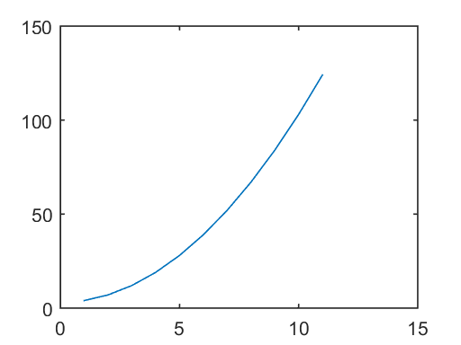

# 1. Introduction 


```python
%load_ext pymatbridge
```

    Starting MATLAB on ZMQ socket tcp://127.0.0.1:56259
    Send 'exit' command to kill the server
    ......MATLAB started and connected!
    


```python
%%matlab
2*3+5
cos(60*pi/180)
x = 4
3/sqrt(2+x)
y = 30;
z= 8;
x = 2; y-z;
w = 4*y+3*z
```


    
    ans =
    
        11
    
    
    ans =
    
        0.5000
    
    
    x =
    
         4
    
    
    ans =
    
        1.2247
    
    
    w =
    
       144
    


```python
%%matlab
x = [1 2 3 4 5 6 7 8 9 10 11]
y = x.^2 + 3
plot(x,y)
```


    
    x =
    
         1     2     3     4     5     6     7     8     9    10    11
    
    
    y =
    
         4     7    12    19    28    39    52    67    84   103   124
    





```python
%%matlab
magic(5)
```


    
    ans =
    
        17    24     1     8    15
        23     5     7    14    16
         4     6    13    20    22
        10    12    19    21     3
        11    18    25     2     9
    


```python

```
