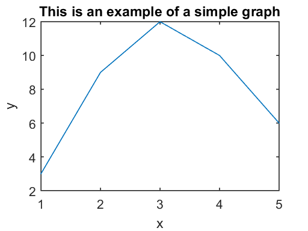
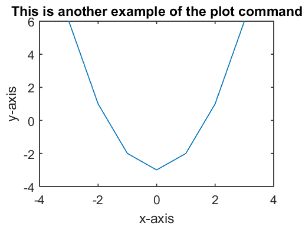
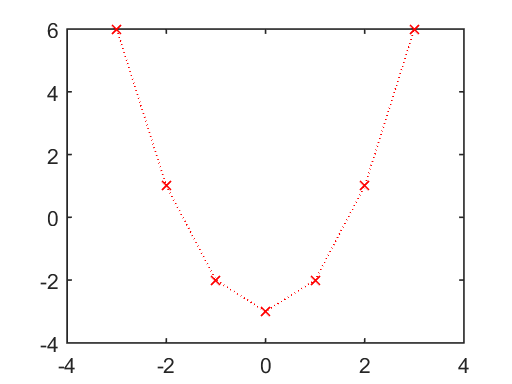
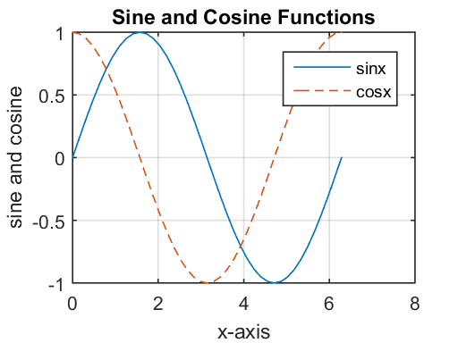
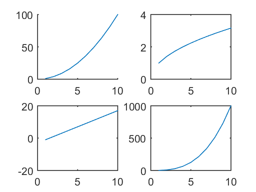
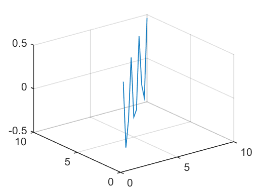
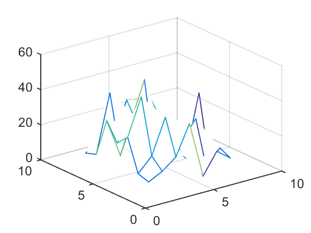
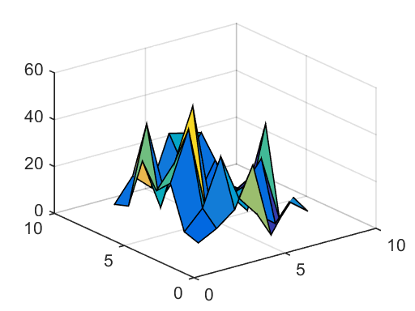
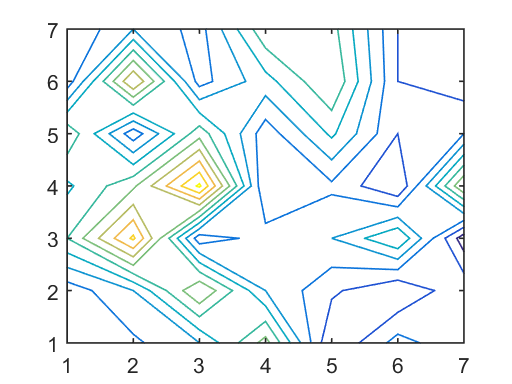
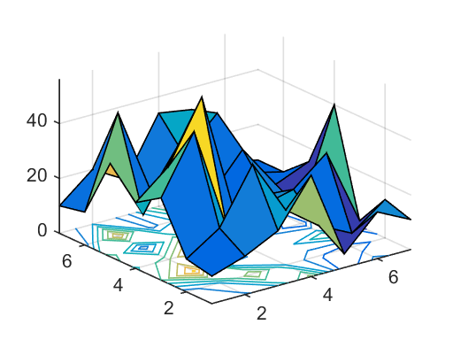

# 5. Graphs in MATLAB 


```python
%load_ext pymatbridge
```

    Starting MATLAB on ZMQ socket tcp://127.0.0.1:54471
    Send 'exit' command to kill the server
    ......MATLAB started and connected!
    


```python
%%matlab
x = [1 2 3 4 5]
y = [3 9 12 10 6]
plot(x,y)
hold on
title('This is an example of a simple graph')
xlabel('x')
ylabel('y')
```


    
    x =
    
         1     2     3     4     5
    
    
    y =
    
         3     9    12    10     6
    





```python
%%matlab
x = [-3 -2 -1 0 1 2 3]
y = x.^2 -3
plot(x,y)
hold on
title('This is another example of the plot command')
xlabel('x-axis')
ylabel('y-axis')
```


    
    x =
    
        -3    -2    -1     0     1     2     3
    
    
    y =
    
         6     1    -2    -3    -2     1     6
    





```python
%%matlab
plot(x,y,'rx:')
```





```python
%%matlab
x = 0:pi/20:2*pi;
y = sin(x);
z = cos(x);
plot(x,y,'-',x,z,'--')
hold on;
grid on;
title('Sine and Cosine Functions')
xlabel('x-axis')
ylabel('sine and cosine')
legend('sinx','cosx')
```





```python
%%matlab
x = [ 1 2 3 4 5 6 7 8 9 10];
y = x.^2;
z = sqrt(x);
w = 2*x - 3;
v = x.^3;
subplot(2,2,1)
hold on;
plot(x,y)
subplot(2,2,2)
plot(x,z)
subplot(2,2,3)
plot(x,w)
subplot(2,2,4)
plot(x,v)
```





```python
%%matlab
x = [1 2 3 4 5 6 7 8 9 10]
y = [1 2 3 4 5 6 7 8 9 10]
z = sin(x).*cos(y)
plot3(x,y,z)
hold on;
grid on;
```


    
    x =
    
         1     2     3     4     5     6     7     8     9    10
    
    
    y =
    
         1     2     3     4     5     6     7     8     9    10
    
    
    z =
    
        0.4546   -0.3784   -0.1397    0.4947   -0.2720   -0.2683    0.4953   -0.1440   -0.3755    0.4565
    





```python
%%matlab
A = [10 14 20 37 5 17 11 ; 12 20 40 20 11 5 14 ; 30 51 12 17 20 30 2 ; 24 ...
34 56 10 14 5 40 ; 34 12 33 12 26 10 15 ; 12 45 13 23 35 10 7 ; 10 20 13 34 ...
32 10 7] 
mesh(A)
```


    
    A =
    
        10    14    20    37     5    17    11
        12    20    40    20    11     5    14
        30    51    12    17    20    30     2
        24    34    56    10    14     5    40
        34    12    33    12    26    10    15
        12    45    13    23    35    10     7
        10    20    13    34    32    10     7
    





```python
%%matlab
surf(A)
```





```python
%%matlab
contour(A)
```





```python
%%matlab
surfc(A)
```





```python

```
