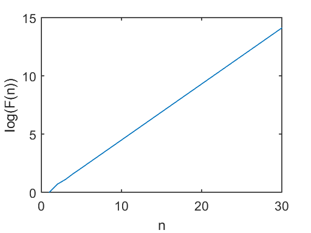

# 6. Fibonacci Numbers 


```python
%load_ext pymatbridge
```

    Starting MATLAB on ZMQ socket tcp://127.0.0.1:54604
    Send 'exit' command to kill the server
    ......MATLAB started and connected!
    


```python
import os
os.listdir('Ch06/')
```


    ['.ipynb_checkpoints',
     'Ch06.ipynb',
     'fibonacci.m',
     'Fig6_1.m',
     'Fig6_2.m',
     'Fig6_3.m',
     'Fig6_4.m',
     'Fig9_6.m',
     'Matlab.m',
     '_vti_cnf']


```python
# %load Ch06/fibonacci.m
function f=fibonacci(n) 
% This function generates the first n Fibonacci numbers
f = zeros(n,1); 
f(1)=1; f(2)=2; 
for k = 3:n
	f(k) = f(k-1) + f(k-2); 
end
```

---


```python
print(1 + 1)
print(2 + 1)
print(3 + 2)
print(5 + 3)
print(8 + 5)
print(13 + 8)
print(21 + 13)
print(34 + 21)
print(55 + 34)
print(89 + 55)
print(144 + 89)
```

    2
    3
    5
    8
    13
    21
    34
    55
    89
    144
    233
    


```python
%%matlab
fibonacci(7)
fibonacci(15)
fibonacci(30)
```


    
    ans =
    
         1
         2
         3
         5
         8
        13
        21
    
    
    ans =
    
         1
         2
         3
         5
         8
        13
        21
        34
        55
        89
       144
       233
       377
       610
       987
    
    
    ans =
    
               1
               2
               3
               5
               8
              13
              21
              34
              55
              89
             144
             233
             377
             610
             987
            1597
            2584
            4181
            6765
           10946
           17711
           28657
           46368
           75025
          121393
          196418
          317811
          514229
          832040
         1346269
    


```python
%%matlab
y = fibonacci(15);
y(15)
```


    
    ans =
    
       987
    


```python
%%matlab
x = 1:10
y = fibonacci(10)
plot(x,y)
hold on
xlabel('n')
ylabel('fibonacci(n)')
```


    
    x =
    
         1     2     3     4     5     6     7     8     9    10
    
    
    y =
    
         1
         2
         3
         5
         8
        13
        21
        34
        55
        89
    


```python
%%matlab
x = 1:30;
y = fibonacci(30);
plot(x,y)
hold on;
xlabel('n')
ylabel('fibonacci(n)')
```


```python
%%matlab
log(fibonacci(10))
```


    
    ans =
    
             0
        0.6931
        1.0986
        1.6094
        2.0794
        2.5649
        3.0445
        3.5264
        4.0073
        4.4886
    


```python
%%matlab
x = 1:10;
y = log(fibonacci(10));
plot(x,y)
hold on
xlabel('n')
ylabel('log(F(n))')
```


```python
%%matlab
m = (y(10)-y(5))/(x(10)-x(5))
```


    
    m =
    
        0.4818
    


```python
%%matlab
x = 1:30;
y = log(fibonacci(30));
plot(x,y)
hold on
xlabel('n')
ylabel('log(F(n))')
```





```python
%%matlab
m = (y(30)-y(10))/(x(30)-x(10))
```


    
    m =
    
        0.4812
    


```python

```
