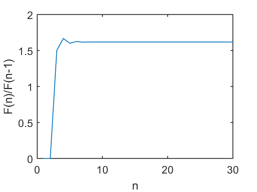

# 7. The Golden Ratio 


```python
import os
os.listdir('Ch07/')
```


    ['.ipynb_checkpoints',
     'Ch07.ipynb',
     'Fig.m',
     'Fig7_1.m',
     'ratio.m',
     '_vti_cnf']


```python
# %load Ch07/ratio.m
function r=ratio(n) 
% This function calculates the ratio of two consecutive Fibonacci numbers 
f = zeros(n,1); 
r = zeros(n,1); 
f(1)=1; 
f(2)=2; 
for k = 3:n
	f(k) = f(k-1) + f(k-2);
	r(k) = f(k)/f(k-1); 
end


```

---


```python
%load_ext pymatbridge
```

    Starting MATLAB on ZMQ socket tcp://127.0.0.1:54702
    Send 'exit' command to kill the server
    ......MATLAB started and connected!
    


```python
print(1/1)
print(2/1)
print(3/2)
print(5/3)
print(8/5)
print(13/8)
print(21/13)
print(34/21)
print(55/34)
print(89/55)
print(144/89)
print(233/144)
print(377/233)
print(610/377)
print(987/610)
```

    1.0
    2.0
    1.5
    1.6666666666666667
    1.6
    1.625
    1.6153846153846154
    1.619047619047619
    1.6176470588235294
    1.6181818181818182
    1.6179775280898876
    1.6180555555555556
    1.6180257510729614
    1.6180371352785146
    1.618032786885246
    


```python
%%matlab
ratio(5)
```


    
    ans =
    
             0
             0
        1.5000
        1.6667
        1.6000
    


```python
%%matlab
ratio(15)
```


    
    ans =
    
             0
             0
        1.5000
        1.6667
        1.6000
        1.6250
        1.6154
        1.6190
        1.6176
        1.6182
        1.6180
        1.6181
        1.6180
        1.6180
        1.6180
    


```python
%%matlab
format long
ratio(30)
```


    
    ans =
    
                       0
                       0
       1.500000000000000
       1.666666666666667
       1.600000000000000
       1.625000000000000
       1.615384615384615
       1.619047619047619
       1.617647058823529
       1.618181818181818
       1.617977528089888
       1.618055555555556
       1.618025751072961
       1.618037135278515
       1.618032786885246
       1.618034447821682
       1.618033813400125
       1.618034055727554
       1.618033963166706
       1.618033998521803
       1.618033985017358
       1.618033990175597
       1.618033988205325
       1.618033988957902
       1.618033988670443
       1.618033988780243
       1.618033988738303
       1.618033988754323
       1.618033988748204
       1.618033988750541
    


```python
%%matlab
x = 1:30;
y = ratio(30);
plot(x,y)
hold on;
xlabel('n');
ylabel('F(n)/F(n-1)')
```





```python
%%matlab
solve('x^2 - x -1 = 0')
```


     
    ans =
     
     1/2 - 5^(1/2)/2
     5^(1/2)/2 + 1/2
     


```python
%%matlab
(1+sqrt(5))/2
```


    
    ans =
    
       1.618033988749895
    


```python
%%matlab
format long
(1+sqrt(5))/2
```


    
    ans =
    
       1.618033988749895
    


```python
%%matlab
(1-sqrt(5))/2
```


    
    ans =
    
      -0.618033988749895
    


```python
%%matlab
format long
(1-sqrt(5))/2
```


    
    ans =
    
      -0.618033988749895
    


```python
%%matlab
phi = (1+sqrt(5))/2
phi^2 - phi - 1
(1-phi)^2 - (1-phi) - 1
```


    
    phi =
    
       1.618033988749895
    
    
    ans =
    
         0
    
    
    ans =
    
         0
    


```python

```
