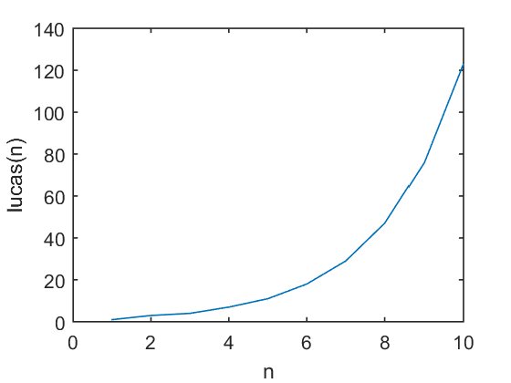
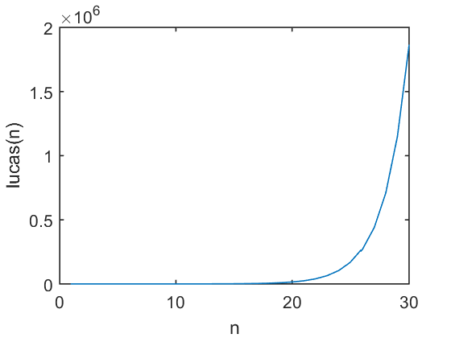
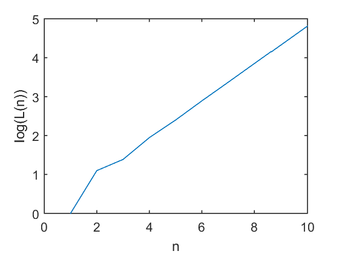
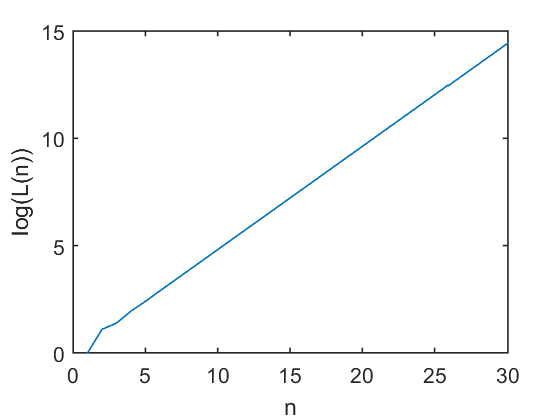
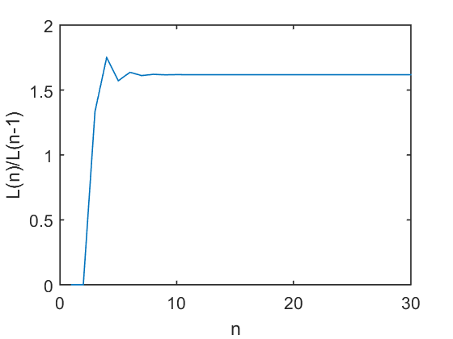

# 9. Lucas Numbers 


```python
import os
os.listdir('Ch09/')
```


    ['.ipynb_checkpoints',
     'approximate_luc.m',
     'Ch09.ipynb',
     'Fig.m',
     'Fig9_1.m',
     'luc.m',
     'lucas.m',
     'lucas_ratio.m',
     'untitled01.m',
     '_vti_cnf']


```python
# %load Ch09/luc.m
function f = luc(n)
% This function generates the nth Lucas number
f = ((1+sqrt(5))/2)^(n-1) + (1-(1+sqrt(5))/2)^(n-1)
```


```python
# %load Ch09/lucas.m
function f=lucas(n) 
% This function generates the first n Lucas numbers 
f = zeros(n,1); 
f(1)=1; 
f(2)=3; 

for k = 3:n
    f(k) = f(k-1) + f(k-2); 
end
```


```python
# %load Ch09/lucas_ratio.m
function r = lucas_ratio(n)
    % This function calculates the ratio oftwo % consecutive Lucas numbers
    f= zeros(n,1);
    r = zeros(n,1);
    f(1)=1;
    f(2)=3;
    
    for k = 3:n
        f(k) = f(k-1) + f(k-2);
        r(k) = f(k)/f(k-1);
    end
```

---


```python
%load_ext pymatbridge
```

    Starting MATLAB on ZMQ socket tcp://127.0.0.1:55809
    Send 'exit' command to kill the server
    ......MATLAB started and connected!
    


```python
1+3
3+4
4+7
7+11
11+18
18+29
29+47
47+76
```


    ans =
    
         4
    
    
    ans =
    
         7
    
    
    ans =
    
        11
    
    
    ans =
    
        18
    
    
    ans =
    
        29
    
    
    ans =
    
        47
    
    
    ans =
    
        76
    
    
    ans =
    
       123


```python
lucas(7)
```


    ans =
    
         1
         3
         4
         7
        11
        18
        29


```python
lucas(20)
```


    ans =
    
               1
               3
               4
               7
              11
              18
              29
              47
              76
             123
             199
             322
             521
             843
            1364
            2207
            3571
            5778
            9349
           15127


```python
x = 1:10
y = lucas(10)
plot(x,y)
hold on
xlabel('n')
ylabel('lucas(n)')
```





    x =
    
         1     2     3     4     5     6     7     8     9    10
    
    
    y =
    
         1
         3
         4
         7
        11
        18
        29
        47
        76
       123


```python
x = 1:30;
y = lucas(30);
plot(x,y)
hold on;
xlabel('n')
ylabel('lucas(n)')
```





```python
log(lucas(10))
```


    ans =
    
             0
        1.0986
        1.3863
        1.9459
        2.3979
        2.8904
        3.3673
        3.8501
        4.3307
        4.8122


```python
x = 1:10;
y = log(lucas(10));
plot(x,y)
hold on
xlabel('n')
ylabel('log(L(n))')
```





```python
m = (y(10)-y(5))/(x(10)-x(5))
```


    m =
    
        0.4829


```python
x = 1:30;
y = log(lucas(30));
plot(x,y)
hold on
xlabel('n')
ylabel('log(L(n))')
```





```python
m = (y(30)-y(10))/(x(30)-x(10))
```


    m =
    
        0.4812


The ratio of each two consecutive Lucas numbers is calculated using
MATLAB as follows:


```python
1/2
3/1
4/3
7/4
11/7
18/11
29/18
47/29
76/47
123/76
199/123
322/199
521/322
843/521
```


    ans =
    
        0.5000
    
    
    ans =
    
         3
    
    
    ans =
    
        1.3333
    
    
    ans =
    
        1.7500
    
    
    ans =
    
        1.5714
    
    
    ans =
    
        1.6364
    
    
    ans =
    
        1.6111
    
    
    ans =
    
        1.6207
    
    
    ans =
    
        1.6170
    
    
    ans =
    
        1.6184
    
    
    ans =
    
        1.6179
    
    
    ans =
    
        1.6181
    
    
    ans =
    
        1.6180
    
    
    ans =
    
        1.6180


```python
format long
lucas_ratio(30)
```


    ans =
    
                       0
                       0
       1.333333333333333
       1.750000000000000
       1.571428571428571
       1.636363636363637
       1.611111111111111
       1.620689655172414
       1.617021276595745
       1.618421052631579
       1.617886178861789
       1.618090452261306
       1.618012422360248
       1.618042226487524
       1.618030842230130
       1.618035190615836
       1.618033529678296
       1.618034164099692
       1.618033921772240
       1.618034014333084
       1.618033978977986
       1.618033992482432
       1.618033987324193
       1.618033989294465
       1.618033988541888
       1.618033988829347
       1.618033988719547
       1.618033988761487
       1.618033988745467
       1.618033988751586


```python
x = 1:30;
y = lucas_ratio(30);
plot(x,y)
hold on
xlabel('n')
ylabel('L(n)/L(n-1)')
```





```python
phi = (1+sqrt(5))/2
L8 = phi^7 + (1-phi)^7
```


    phi =
    
       1.618033988749895
    
    
    L8 =
    
      29.000000000000007


```python
luc(3);
luc(8);
luc(15);
```


    f =
    
         3
    
    
    f =
    
       29.0000
    
    
    f =
    
      843.0000


```python
approximate_luc(3)
approximate_luc(8)
approximate_luc(15)
```


    ans =
    
        2.6180
    
    
    ans =
    
       29.0344
    
    
    ans =
    
      842.9988


```python

```
