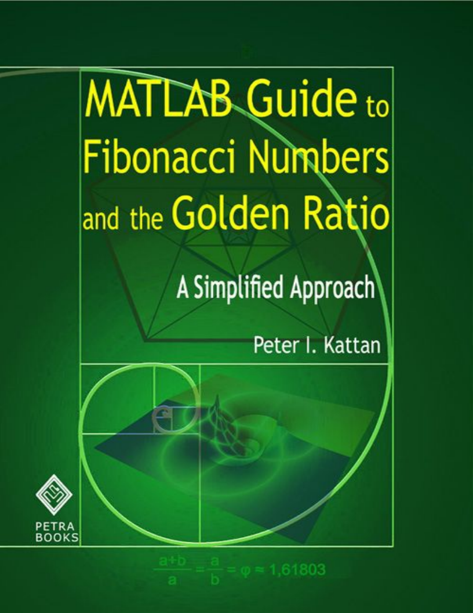

# MATLAB Guide to Fibonacci Numbers and the Golden Ratio: A Simplified Approach
  

* **Info** https://www.mathworks.com/support/books/book89448.html  

## Toc
* [1. Introduction]()  
* [2. Symbolic Computing]()  
* [3. Solving Equations]()  
* [4. MATLAB Functions]()  
* [5. Graphs in MATLAB]()  
* [6. Fibonacci Numbers]()  
* [7. The Golden Ratio]()  
* [8. Properties of the Golden Ratio]()  
* [9. Lucas Numbers]()  
* [10. Generalizations of Fibonacci Numbers]()  
* [11. Random Fibonacci Numbers References]()  